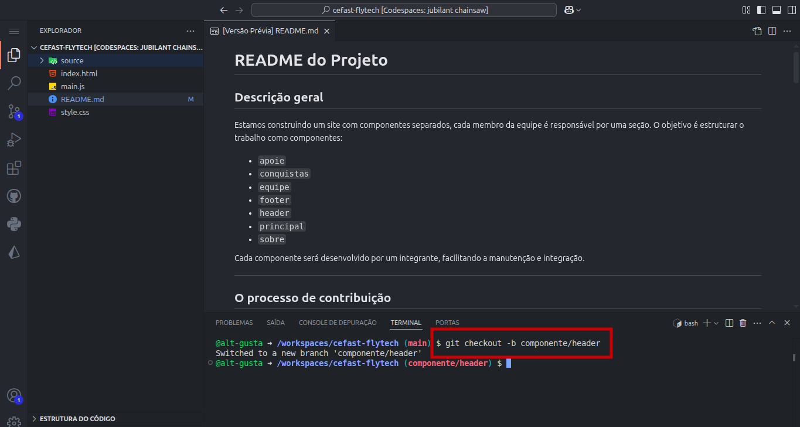

# README do Projeto

## Descrição geral

Estamos construindo um site com componentes separados, cada membro da equipe é responsável por uma seção. O objetivo é estruturar o trabalho como componentes:

* `apoie`
* `conquistas`
* `equipe`
* `footer`
* `header`
* `principal`
* `sobre`

Cada componente será desenvolvido por um integrante, facilitando a manutenção e integração.

---

## O processo de contribuição

Siga este passo a passo para contribuir usando **fork**, **GitHub Codespaces**, **branch**, **commit** e **pull request**.

### 1. Faça um *fork* do repositório principal

1. Acesse o repositório principal no GitHub.
2. Clique em **Fork** (canto superior direito).
3. Seu perfil ficará com uma cópia do projeto.


---

### 2. Abra seu Codespace

1. No seu fork, clique em **Code** > **Codespaces** > **Create codespace on main**.
2. Será aberto o ambiente de desenvolvimento no browser.


---

### 3. Crie uma branch para seu componente

No terminal do Codespace, execute:

```bash
git checkout -b componente/<nome-da-branch>  # ex: componente/conquistas
```

Isso mantém o `main` limpo para integração.



---

### 4. Implemente seu componente

Edite os arquivos HTML/CSS da sua parte.
Por exemplo:

* `conquista.html`, `conquista.css`

Após finalizar:

```bash
git add .
git commit -m "Implementa componente conquistas"
git push --set-upstream origin componente/conquistas
```


---

### 5. Crie um Pull Request

1. Volte ao GitHub (fork).
2. O banner perguntando por PR aparecerá: clique em **Compare & pull request**
3. Use o seletor para comparar sua branch com `main` do upstream.
4. Preencha título/descritivo:

   * Ex: `[conquistas] Adiciona seção de conquistas`
5. Marque como **Draft** se ainda estiver em progresso


### 6. Revisaão e integração

* O líder analisará o código
* Pode solicitar ajustes ou sugerir mudanças
* Quando aprovado, **merge** é feito e a branch é fechada


### 7. Próximos passos

Após o merge, sincronize seu fork com o upstream:

```bash
git checkout main
git fetch upstream
git merge upstream/main
git push origin main
```

Isso mantém seu projeto atualizado.


## Distribuição das tarefas

| Componente | Responsável | Arquivos esperados                               |
| ---------- | ----------- | ------------------------------------------------ |
| apoie      | \[nome]     | apoie.html / apoie.css / apoie.js                |
| conquistas | \[nome]     | conquistas.html / conquistas.css / conquistas.js |
| equipe     | \[nome]     | equipe.html / equipe.css / equipe.js             |
| header     | \[nome]     | header.html / header.css / header.js             |
| principal  | \[nome]     | principal.html / principal.css / principal.js    |
| sobre      | \[nome]     | sobre.html / sobre.css / sobre.js                |
| footer     | \[nome]     | footer.html / footer.css / footer.js             |

Cada membro deverá:

1. Criar sua branch com `componente/<nome>`
2. Implementar o conteúdo
3. Commitar e subir as alterações
4. Abrir o PR conforme fluxo descrito


## Conclusão

Seguindo essas etapas, garantimos organização, separação de trabalho e facilidade de revisão. Qualquer dúvida, estou aqui para ajudar.