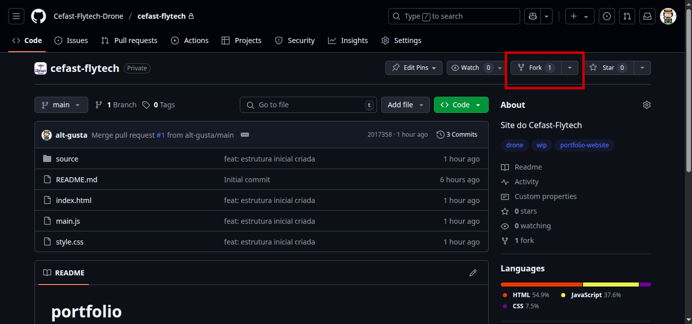
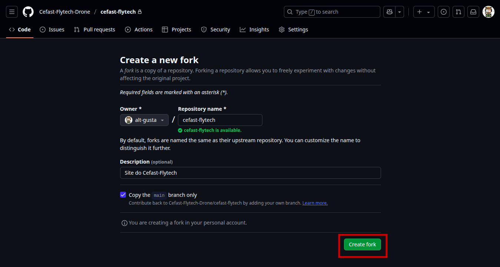
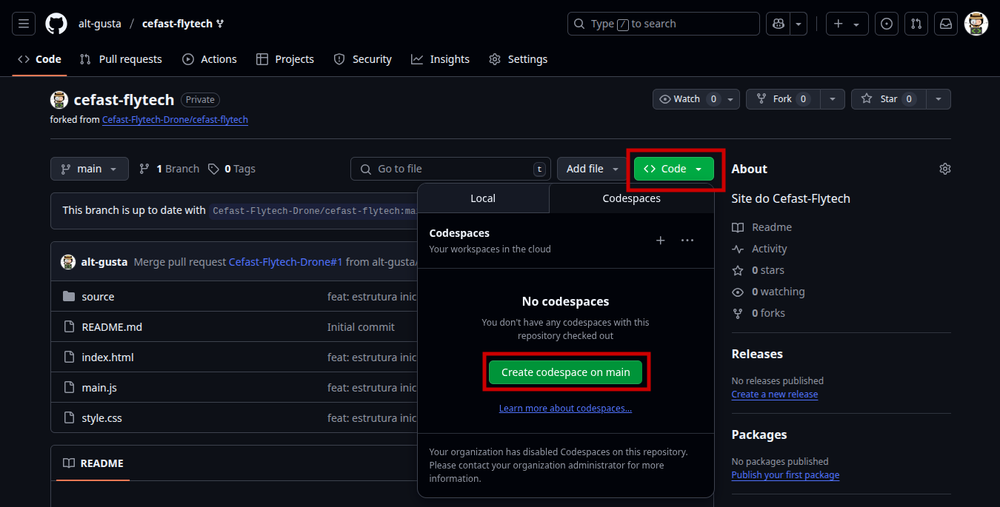
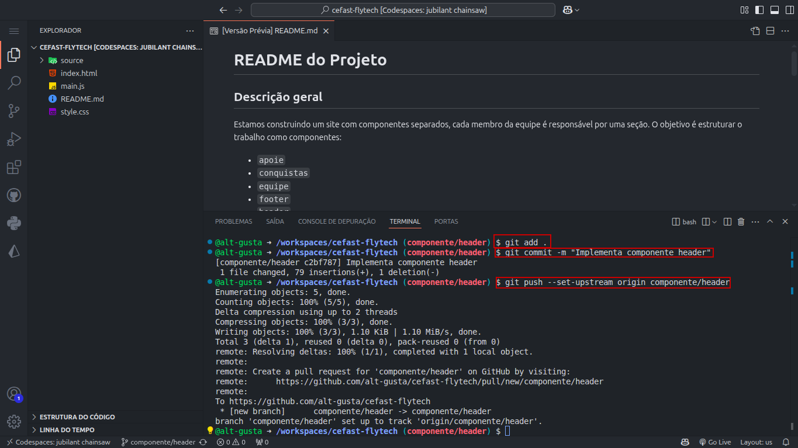
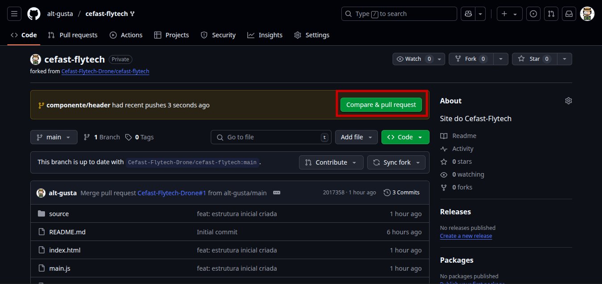
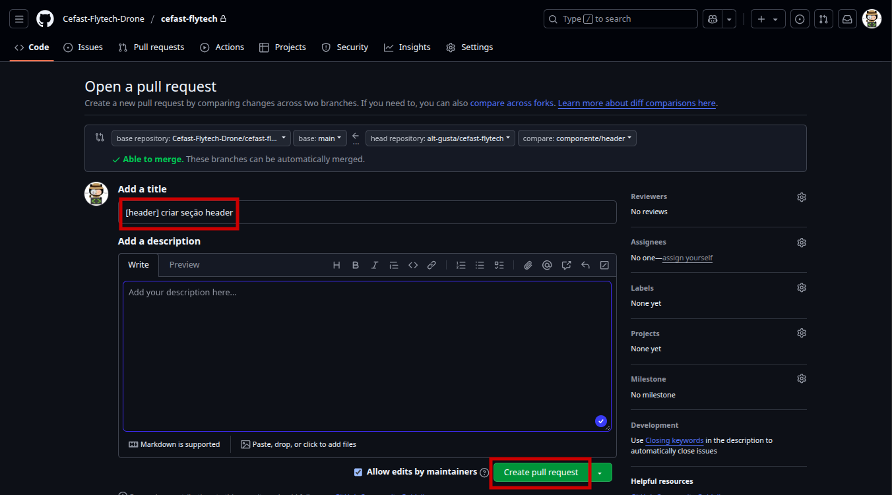

# README

## Descrição geral

Este documento é o nosso guia central para trabalhar neste projeto. Ele explica como vamos usar o Git e o GitHub para colaborar de forma organizada. Por favor, leia com atenção!

## Descrição geral

Estamos construindo um site com componentes separados, onde cada membro da equipe é responsável por uma seção específica. O objetivo é estruturar o trabalho da seguinte forma:

-   `equipe`
-   `rodape`
-   `cabecalho`
-   `principal`
-   `sobre`

Cada componente será desenvolvido por um integrante, facilitando a manutenção e a futura integração do site completo.

---

## Fluxo de Trabalho (Workflow)

Para garantir que nosso trabalho seja consistente e evitar conflitos, seguiremos um fluxo padrão. Ele se divide em duas fases: **Configuração Inicial** (você só faz uma vez) e o **Ciclo de Desenvolvimento** (você repete para cada nova tarefa).

### Fase 1: Configuração Inicial (Feita apenas uma vez)

#### 1. Faça um _fork_ do repositório principal

O _fork_ é uma cópia completa do projeto para o seu perfil pessoal no GitHub. É no seu _fork_ que você irá trabalhar sem afetar o projeto original diretamente.

1.  Acesse o repositório principal do projeto.
2.  Clique em **Fork** no canto superior direito da página.
3.  Escolha seu perfil e o GitHub criará a cópia para você.




#### 2. Configure o repositório principal como `upstream`

Para que o seu _fork_ saiba onde o projeto original está, precisamos criar uma referência para ele. Vamos chamar essa referência de `upstream`.

1.  No seu fork, clique em **Code** > **Codespaces** > **Create codespace on main** para abrir o ambiente de desenvolvimento.

2.  No terminal do Codespace, execute o comando abaixo:

```bash
git remote add upstream [https://github.com/Cefast-Flytech-Drone/cefast-flytech.git](https://github.com/Cefast-Flytech-Drone/cefast-flytech.git)
```

> **O que isso faz?**
> -   `origin`: É o nome padrão para o seu fork (para onde você envia suas alterações).
> -   `upstream`: Será o nome para o repositório original (de onde você vai baixar as atualizações).

---

### Fase 2: O Ciclo de Desenvolvimento (Repetir para cada tarefa)

Sempre que você for começar a trabalhar em uma nova parte do seu componente, siga estes passos:

#### Passo 1: Sincronize seu fork (MUITO IMPORTANTE)

Antes de começar a codificar, garanta que a sua branch `main` está atualizada com a versão mais recente do projeto principal. Isso evita conflitos e garante que você está trabalhando sobre o código mais novo.

No terminal do Codespace, execute os seguintes comandos:

```bash
# 1. Volte para a sua branch principal
git checkout main

# 2. Busque as atualizações do repositório original (upstream)
git fetch upstream

# 3. Mescle as atualizações do upstream/main na sua main local
git merge upstream/main

# 4. Envie a versão atualizada para o seu fork (origin) no GitHub
git push origin main
```

> **Por que isso é importante?** Se outro colega já integrou o componente dele, este passo traz essas atualizações para o seu projeto. Sem isso, seu código ficará desatualizado.

#### Passo 2: Crie uma branch para seu componente

Nunca trabalhe diretamente na branch `main`. Crie uma branch específica para a tarefa que você está fazendo.

```bash
# Crie e mude para a nova branch. Use um nome claro.
git checkout -b componente/equipe
```

> **Por que criar uma branch?** Isso isola seu trabalho, mantendo a branch `main` sempre limpa e funcional. Fica muito mais fácil gerenciar e revisar o código.

#### Passo 3: Implemente seu componente e faça o _commit_

Agora é hora de codificar! Edite, crie e salve os arquivos do seu componente (ex: `equipe.html`, `equipe.css`).

> **Importante:** Nomeie suas classes CSS seguindo o padrão: `componente-classe` (ex: `equipe-card`, `rodape-link`).

Quando terminar uma parte lógica do trabalho, salve suas alterações com um _commit_.

```bash
# 1. Adicione todos os arquivos modificados para a "área de preparação"
git add .

# 2. Crie um "commit" (um ponto de salvamento) com uma mensagem descritiva
git commit -m "feat: implementa a estrutura inicial do componente equipe"

# 3. Envie sua branch com o commit para o seu fork no GitHub
git push --set-upstream origin componente/equipe
```



#### Passo 4: Crie um Pull Request (PR)

Um Pull Request (ou PR) é um pedido para integrar o seu trabalho (da sua branch) no projeto principal.

1.  Acesse a página do seu fork no GitHub.
2.  O GitHub geralmente mostrará um aviso amarelo para criar um PR. Clique em **Compare & pull request**.
3.  **Importante:** Verifique se a base para o merge é a branch `main` do **repositório principal** e a comparação é a sua branch (`componente/equipe`).
4.  Preencha um título e uma descrição claros. Ex: `[equipe] Adiciona seção de equipe`.
5.  Se o trabalho ainda não estiver finalizado, marque-o como **Draft**.
6.  Clique em **Create pull request**.




---

### Revisão e Integração (_Merge_)

-   O líder do projeto ou outros membros irão revisar seu código.
-   Eles podem solicitar ajustes ou deixar comentários. Faça as alterações na sua branch e envie com `git push`. O Pull Request será atualizado automaticamente.
-   Quando tudo estiver aprovado, seu código será integrado (_merged_) ao projeto principal!

Depois disso, você pode apagar sua branch e começar o ciclo novamente a partir do **Passo 1: Sincronize seu fork** para a próxima tarefa.

## Distribuição das tarefas

| Componente | Responsável | Arquivos esperados |
| :--- | :--- | :--- |
| apoie | \[nome] | apoie.html / apoie.css / apoie.js |
| equipe | \[nome] | equipe.html / equipe.css / equipe.js |
| principal | \[nome] | principal.html / principal.css / principal.js |
| sobre | \[nome] | sobre.html / sobre.css / sobre.js |
| rodape | \[nome] | rodape.html / rodape.css / rodape.js |
